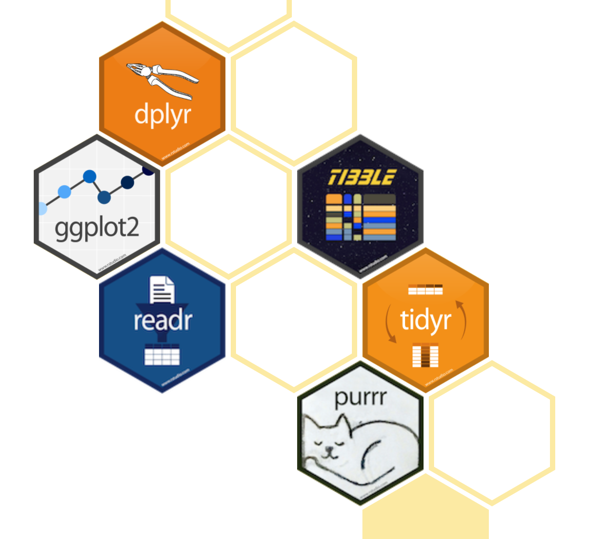

## Agenda

- R, RStudio, and Rstudio cloud

- R Markdown

By now, you should have

- joined the Rstudio cloud group

- installed R and Rstudio locally

- a GitHub account

- completed your first tutorial!

---

## Toolkit


- Scriptability $\rightarrow$ R

- Literate scripts (code, narrative, output in one) $\rightarrow$ R Markdown

- Version control $\rightarrow$ Git / GitHub

---

class: center, middle

# R and RStudio

---

## What is R/RStudio?

- R is a statistical programming language

- RStudio is a convenient interface for R (an integrated development environment [IDE])

---

## Let's take a tour - R / RStudio

<center>
[DEMO]
</center>

--

Concepts introduced:

- Console

- Using R as a calculator

- Environment

- Loading and viewing a data frame

- Accessing a variable in a data frame

- R functions

---

## R essentials

A short list (for now):

- Functions are (most often) verbs, followed by what they will be applied to in parentheses:

```{r eval=FALSE}
do_this(to_this)
do_that(to_this, to_that, with_those)
```

--

- Columns (variables) in data frames are accessed with `$`:

```{r eval=FALSE}
dataframe$var_name
```

--

- Packages are installed with the `install.packages` function and loaded with the `library` function, once per session:

```{r eval=FALSE}
install.packages("package_name")
library(package_name)
```

---

## What is RStudio cloud?

- A hosted version of RStudio in the cloud that makes it easy to teach and learn data science using R.

---

## Let's take a tour - Rstudio cloud

<center>
[DEMO]
</center>

--

Key points

- Primers and cheatsheets are a valuable resource. 

- Workspace contains projects you can open and interact with. 

    + lectures, homeworks, projects, or tutorials. 

- R projects are collections of related files in a specific working directory

- Make sure to save permanent copies of projects (save your work).

- You and I are the only ones who can view and edit files in your saved projects. (This is how I will grade)


---

## What is the Tidyverse?

.pull-left[

]

.pull-right[
<center>
<a href="https://www.tidyverse.org/">tidyverse.org</a>
</center>

- The tidyverse is an opinionated collection of R packages designed for data science. 
- All packages share an underlying philosophy and a common syntax. 
]

- I will teach you the essential functions in the tidyverse along with the essential ideas of base R. 

- If there is time, I will also teach a little bit about `data.table`, the package that saved R!

---

class: center, middle

# R Markdown

---


## R Markdown

- Fully reproducible reports - each time you knit the analysis will be run from the beginning.

- Simple markdown syntax for text

- Code goes in chunks, defined by three backticks, narrative goes outside of chunks

---

## Let's take a tour - R Markdown

<center>
[DEMO]
</center>

--

Concepts introduced:

- Literate programming

- Knitting documents 

- YAML headers and themes

- tabulating data with `gt`

---

## R Markdown tips

- Keep the [R Markdown cheat sheet](https://github.com/rstudio/cheatsheets/raw/master/rmarkdown-2.0.pdf) and Markdown Quick Reference (Help -> Markdown Quick Reference) handy.

- The workspace of your R Markdown document is separate from the Console

---

## How will we use R Markdown?

- Every exercise / assignment / project / etc. is an R Markdown document.

- You'll always have a template R Markdown document to start with.

---

class: center, middle

# Git and GitHub

---

## How do we collaborate?

- The statistical programming language we'll use is R

- The software we use to interface with R is RStudio

But... 

--

- how do I get you the materials for your assignments?

- What happens if I need to update those materials?

- How do I pull my updates into Rstudio cloud?

---

## Version control

- We will only require GitHub use as a platform for collaboration

--

- But it's much more than that...

--

- It's actually desiged for version control

---

## Versioning


---

## Versioning

with human readable messages


---

## Why do we need version control?


---

# Git and GitHub tips

- Git is a version control system -- like “Track Changes” features from Microsoft Word on steroids. GitHub is the home for your Git-based projects on the internet -- like DropBox but much, much better).

--

- There are millions of git commands -- ok, that's an exaggeration, but there are a lot of them -- and very few people know them all. 99% of the time you will use git to add, commit, push, and pull.

--

- We will be not be requiring any formal interaction with git, but if you are not feeling challenged by the class I recommend learning git in your copious free time. 

- There is a great resource for working with git and R: [happygitwithr.com](http://happygitwithr.com/).

---

class: inverse, center, middle

# Recap

---

## Recap

Can you answer these questions?

- What is R vs RStudio?

- What is R Markdown and why does it matter?

- What is git vs GitHub (and do I need to care)?

- What is version control, and why do we care?

---

## Before next class

- Complete readings and primer (see course website)

- Next week we will start in-class exercises as teams.

- Having difficulty? Ask on GitHub or stay after class for office hours!
